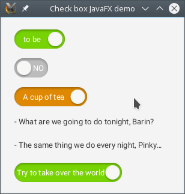

ToggleCheckBox JavaFX control
=============================

ToggleCheckBox is a JavaFX control is the normal CheckBox which is styled as a slider.
But his behavior is usually for the checkbox controls.
He has only two positions: SELECTED and UNSELECTED.

String values to displayed for the selected or unselected state can be set through the controls API.

Example
-------

```java
public class Demo
extends Application
{
    @Override
    public void start(
        Stage primaryStage)
    throws Exception
    {
        VBox vbox = new VBox(20);

        ToggleCheckBox styledCheckBox = new ToggleCheckBox(
            "A cup of tea", "A cup of coffee");
        styledCheckBox.getStyleClass().add("demo-styled");

        vbox.getChildren().addAll(
            new ToggleCheckBox("to be", "not to be"),
            new ToggleCheckBox("YES", "NO"),
            styledCheckBox,
            new Label(
                "- What are we going to do tonight, Barin?"),
            new Label(
                "- The same thing we do every night, Pinky…"),
            new ToggleCheckBox(
                "Try to take over the world", "To do nothing"));

        BorderPane.setMargin(vbox, new Insets(20));
        Scene scene = new Scene(new BorderPane(vbox));

        primaryStage.setScene(scene);
        primaryStage.setMinHeight(200);
        primaryStage.setMinWidth(300);

        primaryStage.setTitle("Check box JavaFX demo");

        primaryStage.show();
    }
}
```



