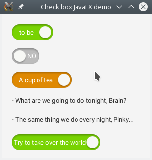
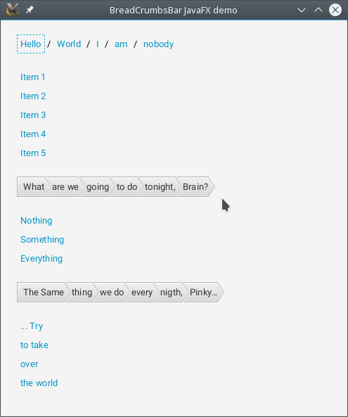

ToggleCheckBox JavaFX control
=============================

ToggleCheckBox is a JavaFX control is the normal CheckBox which is styled as a slider.
But his behavior is usually for the checkbox controls.
He has only two positions: SELECTED and UNSELECTED.

String values to displayed for the selected or unselected state can be set through the controls API.

Example
-------

```java
public class Demo
extends Application
{
    @Override
    public void start(
        Stage primaryStage)
    throws Exception
    {
        VBox vbox = new VBox(20);

        ToggleCheckBox styledCheckBox = new ToggleCheckBox(
            "A cup of tea", "A cup of coffee");
        styledCheckBox.getStyleClass().add("demo-styled");

        vbox.getChildren().addAll(
            new ToggleCheckBox("to be", "not to be"),
            new ToggleCheckBox("YES", "NO"),
            styledCheckBox,
            new Label(
                "- What are we going to do tonight, Brain?"),
            new Label(
                "- The same thing we do every night, Pinky…"),
            new ToggleCheckBox(
                "Try to take over the world", "To do nothing"));

        BorderPane.setMargin(vbox, new Insets(20));
        Scene scene = new Scene(new BorderPane(vbox));

        primaryStage.setScene(scene);
        primaryStage.setMinHeight(200);
        primaryStage.setMinWidth(300);

        primaryStage.setTitle("Check box JavaFX demo");

        primaryStage.show();
    }
}
```




BreadCrumbBar JavaFX control
=============================

Example
-------

```java
public class Demo
extends Application
{
    @Override
    public void start(
        Stage primaryStage)
    throws Exception
    {
        VBox vbox = new VBox(20);

        HyperlinkBreadCrumbsBar<String> breadCrumbsBar0 = new HyperlinkBreadCrumbsBar<>();
        breadCrumbsBar0.setSeparatorSupplier(() -> new Text(" / "));
        breadCrumbsBar0.setBreadCrumbs(Arrays.asList(
            "Hello", "World", "I", "am", "nobody"));
        breadCrumbsBar0.setOnActionConsumer(this::showAlert);
        VBox demoContainer0 = new VBox();
        for (int i = 1; i <= 5; i++)
            addHyperlinkToDemoContainer(
                "Item " + i, demoContainer0, breadCrumbsBar0, String::new);

        ButtonBreadCrumbsBar<String> breadCrumbsBar1 = new ButtonBreadCrumbsBar<>();
        breadCrumbsBar1.setBreadCrumbs(Arrays.asList(
            "What", "are we", "going", "to do", "tonight,", "Brain?"));
        breadCrumbsBar1.setOnActionConsumer(this::showAlert);
        VBox demoContainer1 = new VBox();
        for (String s : new String[] { "Nothing", "Something", "Everything" })
            addHyperlinkToDemoContainer(
                s, demoContainer1, breadCrumbsBar1, String::new);

        ButtonBreadCrumbsBar<String> breadCrumbsBar2 = new ButtonBreadCrumbsBar<>();
        breadCrumbsBar2.setBreadCrumbs(Arrays.asList(
            "The Same", "thing", "we do", "every", "nigth,", "Pinky…"));
        breadCrumbsBar2.setOnActionConsumer(this::showAlert);
        VBox demoContainer2 = new VBox();
        for (String s : new String[] { "... Try", "to take", "over", "the world" })
            addHyperlinkToDemoContainer(
                s, demoContainer2, breadCrumbsBar2, String::new);

        vbox.getChildren().setAll(
            breadCrumbsBar0, demoContainer0,
            breadCrumbsBar1, demoContainer1,
            breadCrumbsBar2, demoContainer2);

        BorderPane.setMargin(vbox, new Insets(20));
        BorderPane bp = new BorderPane(vbox);
        bp.setPrefWidth(1024);
        bp.setPrefHeight(700);

        Scene scene = new Scene(bp);

        primaryStage.setScene(scene);

        primaryStage.setTitle("BreadCrumbsBar JavaFX demo");

        primaryStage.show();
    }

    private <T> void addHyperlinkToDemoContainer(
        String text,
        Pane demoContainer,
        AbstractBreadCrumbsBar<T> breadCrumbsBar,
        Function<String, T> itemCreator)
    {
        Hyperlink button = new Hyperlink(text);
        button.setOnAction(e -> breadCrumbsBar
            .addBreadCrumb(itemCreator.apply(button.getText())));
        demoContainer.getChildren().add(button);
    }

    private void showAlert(
        String s)
    {
        new Alert(AlertType.INFORMATION, s).show();
    }
}
```


